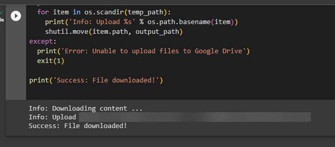

    <h1 align="center">Colab Torrent</h1>

 

Download torrent to google drive with Google Colab

 

<h2>Installation</h2>

<h2>Usage</h2>

1. Install dependencies

2. Fill informations in "Configure download" section

3. Start downloader

